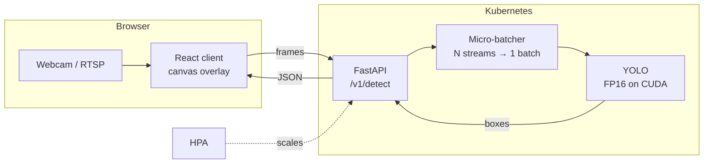

# AI Multimodal Assistant

[](https://github.com/mohammadazam7/ai_multimodal_assistant/actions/workflows/ci.yml)


[](LICENSE)

Real-time object detection on live camera feeds. A FastAPI service runs a YOLO model
(FP16 on GPU), a React client streams webcam frames and draws the detections, and the
service is built to batch frames from many cameras into one forward pass and scale out
on Kubernetes.

> **Status:** under active development. Milestone 1 (detection service) is complete;
> see the [roadmap](docs/ROADMAP.md) for batching, the web client, Kubernetes and
> benchmarks.

## Architecture



## API

| Method | Path | Body | Returns |
|---|---|---|---|
| `GET` | `/healthz` | – | model, device, readiness |
| `POST` | `/v1/detect` | `multipart/form-data` with `file` | detections + timings |
| `POST` | `/v1/detect/base64` | `{"image": "data:image/jpeg;base64,..."}` | detections + timings |

Example response:

```json
{
  "detections": [
    {"label": "person", "confidence": 0.91, "box": {"x1": 12.0, "y1": 30.5, "x2": 210.4, "y2": 470.0}}
  ],
  "width": 640, "height": 480,
  "model": "yolov8n.pt (fp16)",
  "inference_ms": 7.8,
  "total_ms": 11.2
}
```

Each response reports `inference_ms` (model only) and `total_ms` (decode → inference →
post-processing), so latency can be measured from the client without extra tooling.
Interactive docs are served at `/docs`.

## Run it

```bash
cd backend
python -m venv .venv && source .venv/bin/activate

# API + tests only (no torch, starts in seconds; returns no detections)
pip install -e ".[dev]"
VISION_DETECTOR=null uvicorn app.main:app --reload

# Full inference stack (downloads yolov8n weights on first start)
pip install -e ".[inference]"
uvicorn app.main:app
```

```bash
curl -F file=@street.jpg http://localhost:8000/v1/detect
```

Docker:

```bash
docker build -t vision-service backend
docker run -p 8000:8000 vision-service
```

### Configuration

| Variable | Default | Meaning |
|---|---|---|
| `VISION_DETECTOR` | `yolo` | `yolo` or `null` |
| `VISION_MODEL_PATH` | `yolov8n.pt` | any Ultralytics model |
| `VISION_DEVICE` | `auto` | `auto`, `cpu`, `cuda`, `cuda:1`, ... |
| `VISION_HALF_PRECISION` | `true` | FP16 inference on CUDA |
| `VISION_CONFIDENCE` | `0.5` | minimum score |
| `VISION_MAX_IMAGE_BYTES` | `8388608` | larger uploads get `413` |

## Design notes

- **Batch-first detector interface.** `Detector.predict` takes a list of frames, so the
  multi-stream batcher plugs in without changing the API or the model code.
- **Inference off the event loop.** The forward pass runs in a worker thread, so slow
  frames don't block health checks or other requests.
- **Torch is optional.** The API, validation and tests install without the inference
  stack, which keeps CI fast. The `null` detector lets the web client be developed
  without a GPU.
- **Fail loudly on bad input.** Non-images return `415`, bad base64 returns `422`, and
  oversized uploads return `413`, instead of a `200` with an error string.

## Development

```bash
cd backend
pip install -e ".[dev]"
ruff check . && ruff format --check . && mypy app && pytest
```

## License

MIT © Mohammad Azam
